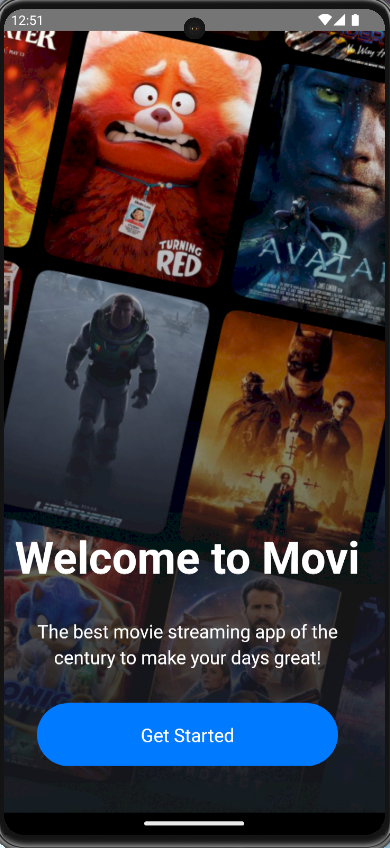
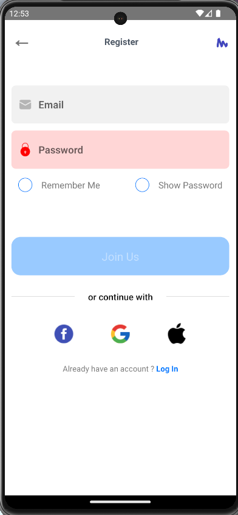
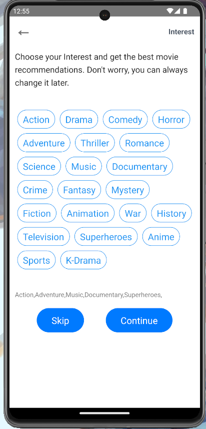
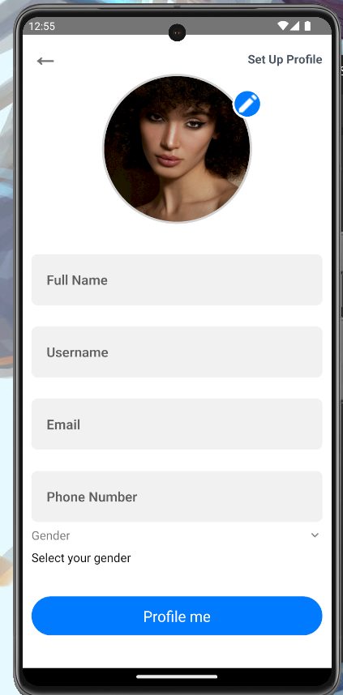
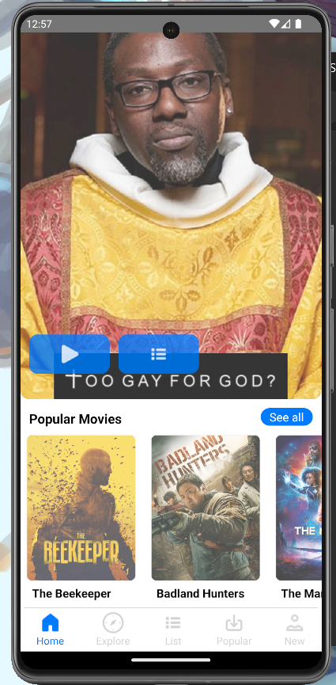
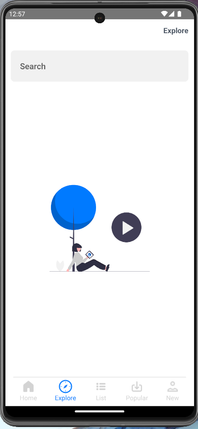
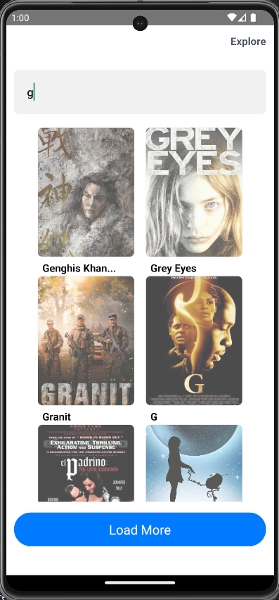
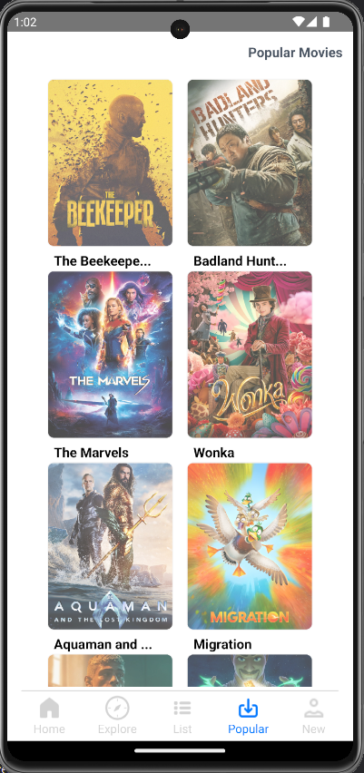
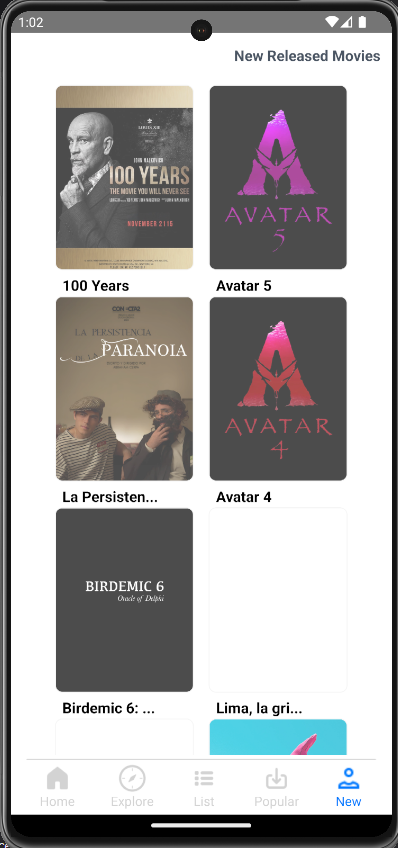

# Movi App with TypeScript React Native & Tailwind CSS

This is a new [**TypeScript React Native**](https://reactnative.dev) project, bootstrapped using [`nnoromiv rnTailwind`](https://github.com/nnoromiv/rnTailwind).

This is a movie application that utilizes the [`themoviedb`](https://www.themoviedb.org/) API.

## Preview

### Welcome



### Options


### Join



### Interest



### Profile



### Home



### No Search



### Search



### Popular



### New Releases



## Getting Started

## Step 1: Clone Repository

```bash
   git clone https://github.com/nnoromiv/Movi.git
```

>**Note**: Make sure you have completed the [React Native - Environment Setup](https://reactnative.dev/docs/environment-setup) instructions till "Creating a new application" step, before proceeding.
>**Dependencies** Install all dependencies

```bash
   cd Movi
```

```bash
# using npm
   npm install

# OR using Yarn
   yarn add 
```

## Step 1: Start the Metro Server

First, you will need to start **Metro**, the JavaScript _bundler_ that ships _with_ React Native.

To start Metro, run the following command from the _root_ of your React Native project:

```bash
# using npm
   npm start

# OR using Yarn
   yarn start
```

## Step 2: Start your Application

Let Metro Bundler run in its _own_ terminal. Open a _new_ terminal from the _root_ of your React Native project. Run the following command to start your _Android_ or _iOS_ app:

### For Android

```bash
# using npm
npm run android

# OR using Yarn
yarn android
```

### For iOS

```bash
# using npm
npm run ios

# OR using Yarn
yarn ios
```

## Step 3: Set Up your API & `.env`

Now that you have successfully run the app, let's modify it.

1. Navigate to [`The Movie DB website`](https://www.themoviedb.org/).
2. Create an Account and get an API.
3. Create a `.env` file in the folder directory
4. Populate your `.env` as follows.

```env

   BASE_URL = 'https://api.themoviedb.org/3'
   API_KEY = 'api_key=YOUR_API_KEY'
   BASE_IMG_URL = 'https://image.tmdb.org/t/p/original'

```

## Step 4: Using the Tailwind

```ts

   import tw from './tailwind'; // The import is relative to your file structure

   const MyComponent = () => (
   <View style={tw`p-4 android:pt-2 bg-white dark:bg-black`}>
      <Text style={tw`text-md text-black dark:text-white`}>Hello World</Text>
   </View>
   );

```

## Congratulations! :tada:

You've successfully run and modified your Movi App. :partying_face:

### Now what?

- If you want to add this new React Native code to an existing application, check out the [Integration guide](https://reactnative.dev/docs/integration-with-existing-apps).
- If you're curious to learn more about React Native, check out the [Introduction to React Native](https://reactnative.dev/docs/getting-started).

## Troubleshooting React Native

If you can't get this to work, see the [Troubleshooting](https://reactnative.dev/docs/troubleshooting) page.

## Learn More about React Native

To learn more about React Native, take a look at the following resources:

- [React Native Website](https://reactnative.dev) - learn more about React Native.
- [Getting Started](https://reactnative.dev/docs/environment-setup) - an **overview** of React Native and how setup your environment.
- [Learn the Basics](https://reactnative.dev/docs/getting-started) - a **guided tour** of the React Native **basics**.
- [Blog](https://reactnative.dev/blog) - read the latest official React Native **Blog** posts.
- [`@facebook/react-native`](https://github.com/facebook/react-native) - the Open Source; GitHub **repository** for React Native.
